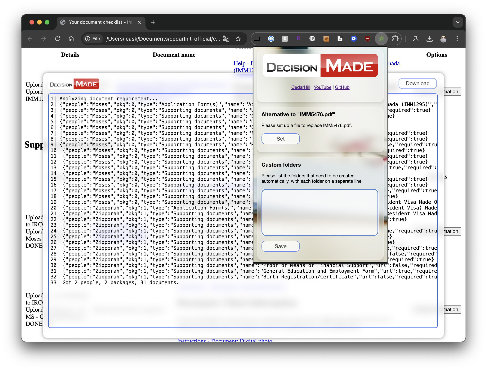

# cedarInit
IRCC Application Documents Download Assistant.



## Development

### Environment

- Node.js
- jq
```bash
$ brew install jq # macOS
$ sudo apt-get install jq # Debian/Ubuntu...
```

### Build

```bash
$ npm install
$ npm run build
```
